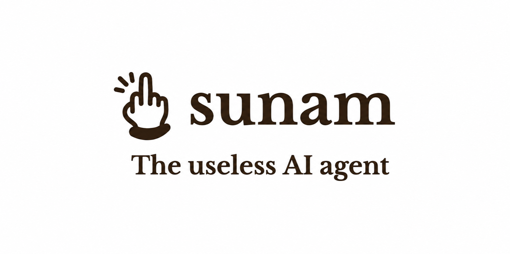

<p align="center">
  
</p>

# Sunam

Sunam 是运行在浏览器中的开源 AI 编程助手。它通过 OpenAI-compatible Chat Completions API 连接模型，并使用 [WebContainer](https://webcontainers.io/) 在浏览器内提供隔离的文件系统、终端和本地服务预览。

项目适合希望自行选择模型服务、在单个浏览器工作区内完成聊天、文件编辑、命令执行与服务预览的开发者。Sunam 不提供模型服务、账号系统或托管后端。

## 目录

- [主要能力](#主要能力)
- [开始使用](#开始使用)
- [配置与数据安全](#配置与数据安全)
- [部署](#部署)
- [开发与验证](#开发与验证)
- [常见问题](#常见问题)
- [文档与贡献](#文档与贡献)

## 主要能力

- OpenAI-compatible Chat Completions API：可设置服务地址、API Key 和模型，并可从兼容的 `/models` 接口读取模型列表。
- 浏览器内工作区：基于 WebContainer 提供文件管理、终端、前后台进程和端口服务预览。
- Agent Core v2：为每次任务建立计划、工具调用、预算、取消域和事件记录；提供基于结构化证据的完成机制。
- 会话与容器隔离：会话、容器、Agent Run、终端输出和文件快照可在同一浏览器中恢复。
- 文件操作：创建、编辑、上传、下载、移动、重命名、删除和可预览文件的查看。
- 中文、English、日本語界面，以及可安装的 PWA。

## 开始使用

### 前置条件

- Node.js 22（CI 使用的版本）
- npm
- 现代 Chromium 浏览器（推荐 Chrome 或 Edge）
- 可用的 OpenAI-compatible 模型服务和 API Key

克隆并启动开发服务器：

```bash
git clone https://github.com/CJackHwang/SunamAI.git
cd SunamAI
npm ci
npm run dev
```

开发服务器固定为 <http://localhost:7891>。首次进入应用后，在设置中填写：

1. API 服务地址（通常以 `/v1` 结尾）；
2. API Key；
3. 对应服务可用的模型名称。

模型服务至少需要兼容 Chat Completions（通常是 `/chat/completions`）。如果其提供 `/models`，Sunam 可以读取模型列表；没有该接口时可直接手动输入模型名。

### 推荐使用流程

1. 新建或选择一个会话和容器。
2. 使用聊天框描述任务；复杂任务会显示 Agent 计划和执行状态。
3. 在文件与终端面板检查改动和命令输出，必要时可停止 Agent 所有的进程。
4. 启动开发服务后，从服务面板打开预览链接。

刷新页面会恢复已持久化的工作区数据；正在执行的 Agent 不会被伪装为继续运行，而是标记为“中断”，可从 checkpoint 新建一次继续执行。

## 配置与数据安全

Sunam 是纯前端应用。浏览器直接向你指定的模型服务发起请求：

| 数据 | 保存位置 | 注意事项 |
| --- | --- | --- |
| API 地址、API Key、模型与界面语言 | 当前浏览器的 Local Storage（`sunam_v2_*`） | 不要在公共设备或共享浏览器保存个人密钥。 |
| 会话、容器、Agent 事件、终端记录、文件快照 | 当前浏览器的 IndexedDB（`sunam-v2`） | 清理站点数据会删除这些本地工作数据。 |
| 聊天请求、工具结果与工作区内容 | 发送给你配置的模型服务 | 适用该服务提供商的隐私、保留、配额与计费规则。 |

不要把真实密钥提交到仓库、构建产物或前端环境变量。公开部署时，建议让每位用户自行配置密钥；如要使用服务端代理，请先设计好鉴权、配额、审计和密钥保护。

模型服务还必须允许部署域名的跨域请求（CORS）。

## 部署

WebContainer 需要 cross-origin isolation。生产站点必须使用 HTTPS，并在页面响应中返回：

```text
Cross-Origin-Embedder-Policy: credentialless
Cross-Origin-Opener-Policy: same-origin
```

缺少这些响应头时，终端和浏览器内运行时可能无法启动。

### Vercel

仓库中的 `vercel.json` 已包含上述响应头。导入仓库后：

1. 选择 Vite 项目；
2. 将 Node.js 版本设为 22；
3. 使用构建命令 `npm run build`；
4. 将输出目录设为 `dist`；
5. 部署后通过 HTTPS 访问。

通常不需要配置 API Key 环境变量，因为密钥由终端用户在浏览器中保存。

### 其他静态托管

```bash
npm ci
npm run build
```

发布 `dist/` 目录，并在 CDN 或静态服务器上为应用页面配置上面的 COEP/COOP 头。上线后至少验证：可以创建容器、读写文件、打开终端并启动一个可预览服务。

## 开发与验证

```bash
npm run dev            # 启动开发服务器（端口 7891）
npm run typecheck      # TypeScript 项目检查
npm run lint           # Oxlint
npm run test           # Vitest 单元与组件测试
npm run test:coverage  # 测试并生成覆盖率报告
npm run test:e2e       # Playwright 端到端测试
npm run test:visual    # Playwright 视觉回归测试
npm run test:runtime   # Chromium 中的真实 WebContainer 冒烟测试
npm run build          # 类型检查后生成生产构建
npm run preview        # 本地预览 dist/
npm run check          # typecheck、lint、coverage、build 与包体检查
```

首次运行 Playwright 可能需要安装对应浏览器；按 Playwright 的提示执行安装命令即可。`test:runtime` 使用真实 WebContainer，但不会使用真实 API Key 发送模型请求。

## 常见问题

### 终端或 WebContainer 无法启动

确认正在使用 HTTPS（本地开发除外），并检查页面响应是否同时带有 `Cross-Origin-Embedder-Policy: credentialless` 和 `Cross-Origin-Opener-Policy: same-origin`。某些浏览器扩展、反向代理或 CDN 规则可能会移除这些头。

### 无法加载模型或发送消息

检查 API 地址、Key 和模型名；确认提供商支持 Chat Completions，并允许当前站点域名的 CORS 请求。模型列表加载失败不一定代表聊天不可用，可直接输入模型名。

### 刷新后数据不见了

Sunam 只在当前浏览器配置文件中保存数据。无痕窗口、浏览器站点数据清理、换浏览器或换设备都不会带走数据。IndexedDB 不可用时，应用会暂停编辑以避免制造“已保存”的错觉。

## 文档与贡献

- [架构与依赖边界](docs/architecture.md)
- [Agent Core v2 设计](docs/agent-v2-design.md)
- [发布与重构验收清单](docs/refactor-acceptance.md)

欢迎提交 Issue 和 Pull Request。提交前请运行与改动范围相称的验证；涉及交互、终端或 WebContainer 时，建议额外执行 `npm run test:e2e` 或 `npm run test:runtime`。贡献者须确保其提交可以按本项目许可证发布，并保留第三方组件原有的版权和许可证声明。

## 许可证

本项目采用 [GNU Affero General Public License v3.0](LICENSE)（AGPL-3.0）。如果你修改本项目并通过网络向用户提供该版本，AGPL 第 13 节要求向与该版本远程交互的用户提供取得对应源代码的机会。完整条款以仓库内的 [LICENSE](LICENSE) 和 [GNU 官方文本](https://www.gnu.org/licenses/agpl-3.0.html) 为准。
