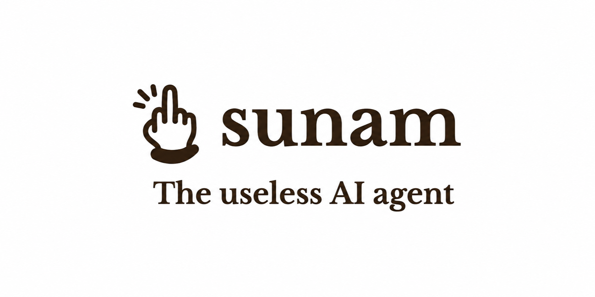

<p align="center">
  
</p>

# Sunam

[](LICENSE)
[](CONTRIBUTING.md)

> Language: **English** | [简体中文](docs/README.zh-CN.md)

**A browser-native AI coding assistant: the pi agent engine working inside a Succinix container environment. No installation, no backend — your browser tab is the workspace.**

Sunam runs entirely in a Chromium browser tab. It pairs the **pi** agent engine ([`@earendil-works/pi-agent-core`](https://www.npmjs.com/package/@earendil-works/pi-agent-core) + [`@earendil-works/pi-ai`](https://www.npmjs.com/package/@earendil-works/pi-ai)) with the **Succinix** container environment ([`@succinix/engine`](https://www.npmjs.com/package/@succinix/engine), WebContainer-based) so the agent can chat, inspect and edit a real workspace, run commands, manage processes and services, and verify its own results — all client-side, with your own model provider.

Sunam does not host models, accounts, or a backend. It connects directly from the browser to any OpenAI-compatible (or Anthropic-messages) model service you configure.

---

## Features

### pi agent engine

- **One agent engine — pi.** The former custom `AgentEngine` has been removed; the [pi framework](https://www.npmjs.com/package/@earendil-works/pi-agent-core) is the only execution kernel. It drives chat, tool calls, subagents and compaction, and bridges every pi event into the existing UI state model.
- **18 agent tools.** Workspace (`workspace_tree` / `read_file` / `search_workspace`), process (`run_command` / `manage_process` / `read_user_terminal`), resources (`list_resources` / `read_resource_text` / `read_resource_image` / `materialize_resource`), subagents (`spawn_subagent` / `wait_subagents` / `message_subagent`), and control (`update_plan` / `report_progress` / `ask_user` / `ask_parent` / `complete_task`). Every tool carries a `capability` declaration that is enforced at compile time.
- **Automatic context compaction.** Before each turn, pi checks the effective context window (model-profile-derived, conservative 32k for unknown models) and compacts at 90% of the usable window: a summary plus a retained tail is written back to the persisted session, so long conversations keep working without a user-facing compression button.
- **Subagents.** Up to **3 concurrent** child runs (6 per root, depth 1). `explore` children are read-only; `task` children have full non-delegating tools. Children inherit the parent's turn/tool/time budgets with independent counters, and real workspace mutations are serialized through a global container mutation lease.
- **Resource attachments.** Up to 8 resources per message (text 2 MiB, images 10 MiB, other binaries 20 MiB, 50 MiB per batch), SHA-256 deduplicated per session, persisted as Blobs in IndexedDB with durable references in the message ledger. Images are re-scaled to a ≤1.5 MiB model copy.
- **Driver abstraction.** The UI talks to an `AgentDriver` interface. The built-in **pi driver** is the default; experimental ClaudeCode / Codex CLI bridges exist behind the same interface but are not shipped as defaults.
- **Honest boundaries.** The pi channel does not implement the old engine's "retry with text when vision is refused" fallback: if the configured model rejects images, the request fails honestly. `ask_user` / `ask_parent` blocking semantics are not preserved in pi's autonomous loop — the adapter returns the question as a tool result and the model asks in its reply.

### Succinix container environment

- **Real container in the browser.** Succinix runs a [TerminalExecutor](https://github.com/CJackHwang/Succinix) host inside WebContainer: `node` / `npm` / `npx` run on a **real Node.js** child process, `python` / `pip` on a **resident Pyodide** daemon, and everything else (`grep`, `sed`, `tar`, pipes, redirects, …) on the **Lifo** Unix userland — all sharing one filesystem.
- **File-RPC command channel.** The agent and the user terminal execute commands through Succinix's file RPC (`/cmd.json` → `/result-<id>.json`, one result file per request). Timeouts, exit codes, stdout/stderr and the `runtime` tag flow through unchanged.
- **Cross-container process isolation.** The Succinix process table carries a `scope` (`system` / `container` / `unknown`) and an optional `containerId`. Sunam filters processes per virtual container and blocks cross-container kills; protected system processes cannot be stopped from the UI.
- **Snapshots — dual layer.** Succinix automatically snapshots the container filesystem to IndexedDB (`succinix-persist`, text-first, honest exclusions), while Sunam keeps its agent session checkpoints in `sunam-v3`. Refresh restores both the workspace files and the agent conversation.
- **Virtual ports & services.** `server-ready` events register preview URLs; the services panel shows managed ports and offers precise stop actions (never guessing a PID from a port number).

### Standalone settings page

- **Providers** — manage model providers (16 presets including DeepSeek, OpenAI, Anthropic, OpenRouter, Groq, Mistral, xAI, Cerebras, …), each with its own base URL, API key, default model and request API (`openai-completions` or `anthropic-messages`), plus a global conversation model with a "fetch models" button.
- **Personas** — reusable system prompts with model parameters (temperature / top-p / max tokens) and a model binding that is either `auto` (follow the global model) or pinned to a specific provider + model. Enabled personas appear instantly in the chat model selector.
- **About** — project info, GitHub repo, AGPL-3.0 license, and a direct link to the **Succinix** project.

### Product

- **Chat / Computer / Capability Library** — the "Sunam computer" merges terminal, user shell, services and files into one view with a capsule dynamic island; the capability library panel gives module-level and per-tool switches for what the AI can perceive.
- **Container three states** — `enabled` / `off` / `restricted` (boot failure). Off truly releases the container (flush snapshot → teardown); restricted degrades gracefully to chat-only.
- **Multilingual & PWA** — 中文 / English / 日本語 UI, installable as a PWA.

## Quick Start

Requirements: **Node.js 22**, npm, a modern **Chromium** browser (Chrome/Edge), and an OpenAI-compatible or Anthropic-messages model service with an API key.

```bash
git clone https://github.com/CJackHwang/SunamAI.git
cd SunamAI
npm ci
npm run dev
```

The dev server is fixed at <http://localhost:7891> and serves the required cross-origin-isolation headers (COOP/COEP). Open it, go to **Settings → Providers**, add a provider (or pick a preset) and save your API key, then start a conversation.

Suggested workflow: pick a session and a container, describe a task and attach resources as needed, then watch the plan, compaction and subagent summaries in the RunBoard and verify results in the file / terminal / services views. Complex tasks only complete after the current workspace revision passes verification.

## Tech Stack

| Layer | Choice |
| --- | --- |
| Agent engine | [`@earendil-works/pi-agent-core`](https://www.npmjs.com/package/@earendil-works/pi-agent-core) + [`@earendil-works/pi-ai`](https://www.npmjs.com/package/@earendil-works/pi-ai) |
| Container environment | [Succinix](https://github.com/CJackHwang/Succinix) / [`@succinix/engine`](https://www.npmjs.com/package/@succinix/engine) over [`@webcontainer/api`](https://www.npmjs.com/package/@webcontainer/api) |
| UI | React 19, xterm.js, react-markdown, lucide-react |
| Language & build | TypeScript (strict), Vite 8, Vitest, Playwright, Oxlint |
| Persistence | IndexedDB (`sunam-v3`, `succinix-persist`) + Local Storage (`sunam_v2_*`) |
| License | AGPL-3.0 |

## Data & Privacy

Sunam is a pure frontend application. The browser talks directly to the model service you configure.

| Data | Stored in | Notes |
| --- | --- | --- |
| API keys, provider/persona config, language | Local Storage (`sunam_v2_*`) | Do not save personal keys on a shared device. |
| Sessions, containers, runs, events, resources, terminal history, snapshots | IndexedDB (`sunam-v3` + `succinix-persist`) | Clearing site data deletes everything. |
| Prompts, selected files, tool results sent to the model | Your configured provider | Sunam never uploads the whole workspace by default; the provider's own privacy / retention rules apply. |

Never commit real keys. Deployments should let each user configure their own key, or proxy through a backend you design with its own auth / audit / quota. The model service must allow CORS from your deployment origin.

## Deployment

WebContainers require cross-origin isolation. A production site must be HTTPS and return:

```text
Cross-Origin-Embedder-Policy: credentialless
Cross-Origin-Opener-Policy: same-origin
```

The repo's `vercel.json` already ships these headers. For Vercel or any static host: `npm run build`, publish `dist/`, keep Node 22. After launch, at least verify container creation, file read/write, terminal boot and local-service preview.

## Development & Verification

```bash
npm run dev            # dev server on port 7891
npm run typecheck      # strict TypeScript
npm run lint           # Oxlint
npm run test           # Vitest unit & component tests
npm run test:coverage  # full core coverage
npm run test:e2e       # Playwright end-to-end flows
npm run test:visual    # desktop / mobile visual regression
npm run test:runtime   # real Succinix/WebContainer acceptance
npm run check:audit    # production dependency high/critical audit
npm run build          # typecheck + production build
npm run check          # typecheck + lint + architecture + coverage + build + bundle
npm run check:all      # check + e2e + visual + runtime + audit
```

Freeze gates: core lines/functions/statements ≥85%, branches ≥80%; initial JS ≤90 KiB gzip, total JS ≤350 KiB gzip (pi lazy-load channel +~95 KiB, see `scripts/check-bundle.mjs`), production `dist` ≤1.8 MiB. Playwright visual diff limit 0.2%.

The repository uses the **Trellis** engineering workflow. Root `AGENTS.md` is the unified AI engineering entry; the real project specs live in `.trellis/spec/`, task & research records in `.trellis/tasks/`, and per-developer logs in `.trellis/workspace/`. See [CONTRIBUTING.md](CONTRIBUTING.md) for the full contribution guide.

## Documentation

English · 中文:

- **README** — this document: [English](README.md) · [中文](docs/README.zh-CN.md)
- **FEATURES** — implemented capabilities & honest boundaries: [English](docs/FEATURES.md) · [中文](docs/FEATURES.zh-CN.md)
- **Architecture** — module responsibilities, dependency boundaries, key data flows: [架构与依赖边界](docs/architecture.md)
- **Agent runtime design** — pi session, driver, IndexedDB persistence, compaction, subagents: [Agent 运行设计](docs/agent-v2-design.md)
- **Capability extension guide** — building capability modules / MCP / plugins: [能力库扩展模块开发指南](docs/extension-development.md)
- **Dependency advisory policy** — production audit gate & the PWA/Workbox exception: [依赖 Advisory 策略](docs/dependency-advisories.md)
- **Release & freeze acceptance** — the legacy (pre-pi) acceptance checklist: [发布与优化冻结验收](docs/refactor-acceptance.md)
- **CHANGELOG** — change history: [English](CHANGELOG.md) · [中文](CHANGELOG.zh-CN.md)
- **CONTRIBUTING** — how to contribute: [English](CONTRIBUTING.md) · [中文](CONTRIBUTING.zh-CN.md)

## Succinix

Sunam depends on **[Succinix](https://github.com/CJackHwang/Succinix)** — a browser-native Linux (WebContainer + Lifo + real Node.js) that provides the container environment, terminal execution and process/port management this project is built on. Succinix is an independent open-source project; the `@succinix/engine` npm package is the integration surface Sunam consumes.

## License

[GNU Affero General Public License v3.0](LICENSE). When you offer a modified version over a network, you must make the corresponding source available under AGPL section 13. The full terms are in the repository's `LICENSE` and the [official GNU text](https://www.gnu.org/licenses/agpl-3.0.html).
